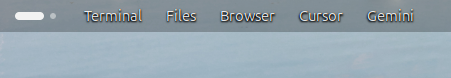

# Slots

[繁體中文](README.zh-TW.md)

[Install](#install) • [Presets](#presets) • [Settings](#settings) • [LLM policy](#llm-policy)


Up to five buttons on the left of the GNOME panel, with the focused application’s name in bold just to the right of Activities. Each button opens an app, a website, or the applications overview.



---

### Table of Contents

- [Introduction](#introduction)
- [Features](#features)
- [Prerequisites](#prerequisites)
- [Install](#install)
- [Presets](#presets)
- [Settings](#settings)
- [LLM policy](#llm-policy)

# Introduction

The panel already has room for a few words. Activities is one. Apps and Places, when you use them, are others. Slots is the same kind of button, repeated up to five times, with the label and the action chosen by you. A click does the thing that button was given.

Its defaults are guided by three ideas:

+ **One button, one action.** Open an application, open a URL, or open the applications overview. Nothing else is hiding behind the click.
+ **Show what is in front.** The focused application’s name sits in bold, immediately to the right of Activities. The shortcut buttons follow that name.
+ **Sit with the panel you already have.** Activities stays where GNOME put it. Apps Menu and Places can be installed or not; Slots does not look for them.

UUID: `slots@jettakarn`.

# Features

- Up to five separate buttons on the left of the panel, after the focused application’s name.
- Three actions: an installed application, a website in the default browser, or the applications overview.
- The focused application’s name, in bold, to the right of Activities. It is a label. With no focused window, only the shortcut buttons remain.
- Two presets, Default and macOS, and a Custom state that takes over when you edit a button.
- A title you write. Leave it empty and the button uses the application name, the site’s host, or “Apps”.
- Text, an icon, or both. An empty icon name uses the application’s own icon, a browser icon for websites, or the app-grid icon for Show Applications.
- A preferences window with two pages: Buttons, then About.

# Prerequisites

- GNOME Shell 46
- User extensions enabled (the default on a normal GNOME session)

# Install

```sh
git clone https://github.com/jettakarn/slots.git
cd slots
mkdir -p ~/.local/share/gnome-shell/extensions
ln -sfn "$(pwd)" ~/.local/share/gnome-shell/extensions/slots@jettakarn
glib-compile-schemas ~/.local/share/gnome-shell/extensions/slots@jettakarn/schemas
gnome-extensions enable slots@jettakarn
```

On Wayland, log out and back in once so the shell can see the new extension. After that, disable and enable Slots to pick up code changes.

Open **Extensions**, choose **Slots**, and set the buttons there. Changes show up on the panel without another login.

# Presets

The focused application’s name is always separate from the preset. It appears in bold, immediately to the right of Activities, and the preset buttons follow it. Choosing a preset replaces all five buttons. **Reset** applies the current preset again. Editing any button switches the preset to **Custom**.

**Default** turns on three text buttons:

- **Terminal** opens a terminal
- **Files** opens the file manager
- **Browser** opens the default web browser

The other two stay off.

**macOS** turns on five text buttons:

- **Files** opens the file manager
- **Apps** opens the applications overview
- **Browser** opens the default web browser
- **Mail** opens the default mail client (`mailto`)
- **Settings** opens Settings

If nothing on the system handles `mailto`, Mail stays in the list as not installed and does not appear on the panel until you choose an application for it.

The Default terminal, files, and browser buttons look for an installed match when their usual desktop file is missing. A button whose chosen application has been removed is hidden until you pick another one.

# Settings

The preferences window has two pages. **Buttons** is the one you use. **About** is the name, version, UUID, supported shell, and the repository link.

On **Buttons**:

- **Preset** is Default, macOS, or Custom. **Reset** writes the selected Default or macOS preset again.
- Each panel button is one row. The switch on that row shows or hides it. Expand the row to edit it.
- **Title** is the text on the button.
- **Type**
  - **Application.** Choose an installed application. A click opens it, or brings its window forward if it is already running.
  - **Website.** Enter a URL. `https://` is added when the address has no scheme.
  - **Show Applications.** Open the applications overview.
- **Label style** is Text, Icon, or Text and icon.
- **Icon name** overrides the automatic icon. Example: `utilities-terminal-symbolic`. It is shown only when the label style includes an icon.

# LLM policy

This repository was developed with AI. The extension, its presets, and this README were written with an AI coding assistant, then reviewed and kept by the maintainer.

AI-assisted contributions are fine. Say so in the pull request, keep the change small enough to review, and answer questions about it yourself.
